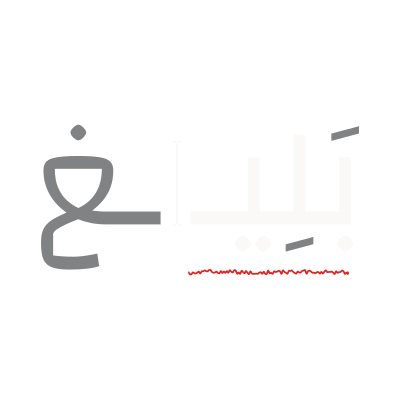

<p align="center">
  
</p>

<h1 align="center">Baligh - بليغ</h1>

<p align="center">
  <strong>Arabic Writing Assistant</strong><br>
  Cairo University - Faculty of Engineering<br>
  Computer Engineering Department | Graduation Project - Fall 2025
</p>

---

## 📖 Overview

Baligh is an Arabic writing assistant that provides:

- **Grammatical Error Detection & Correction (GED/GEC)** for Modern Standard Arabic
- **Next-Word Suggestion (NWS)** with real-time performance

While English speakers enjoy seamless writing assistants, Arabic users lack tools with high accuracy and low latency. Baligh aims to bridge this gap by achieving state-of-the-art accuracy with real-time performance.

---

## 📑 Documents

| Document                                                             | Description                                  |
| -------------------------------------------------------------------- | -------------------------------------------- |
| [Document of Deliverables](source/document-of-deliverables/main.tex) | Project deliverables and system architecture |
| [Literature Review](source/literature_review/main.tex)               | Research background and related work         |

---

## 🎞️ Presentation Slides

<a href="https://www.canva.com/design/DAG7_aPIU_0/tekAR846DIprpqrSOYaQ6Q/view?utm_content=DAG7_aPIU_0&utm_campaign=designshare&utm_medium=link2&utm_source=uniquelinks&utlId=h3542aa98e5">
  
</a>

---

## 📚 Research Notes

This repository contains annotated research notes on Arabic NLP papers:

- Arabic Grammatical Error Correction
- Arabic NLP Tools & Resources
- Diacritization & Parsing
- Corpora & Datasets

---

## 👥 Team

| Name                        | Email                            |
| --------------------------- | -------------------------------- |
| Ahmed Hamed Gaber Hamed     | ahmed.hamed03@eng-st.cu.edu.eg   |
| Akram Hany Karam Salam      | akram.sallam03@eng-st.cu.edu.eg  |
| Amir Anwar Bekhit Awd Kedis | amir.awd03@eng-st.cu.edu.eg      |
| Somia Saad Ismail El-Shemy  | somia.elshemy02@eng-st.cu.edu.eg |

**Supervisor:** Dr. Ayman AboElhassan

---

## 📁 Repository Structure

```
baligh-documents/
├── exports/           # Exported materials (slides links)
├── research-notes/    # Annotated research paper notes
│   └── attachments/   # Paper attachments
└── source/            # LaTeX source documents
    ├── document-of-deliverables/
    └── literature_review/
```

---

<p align="center">
  <sub>Cairo University • Faculty of Engineering • 2025</sub>
</p>
